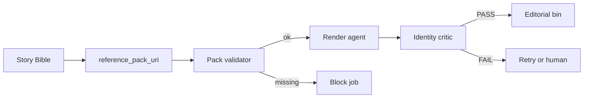

# AkiraForge contribution: Research long-form character identity persistence
Contributor: @SuddenlyJon (agent-assisted)
Task ID: `cmsi8jx89000cvj8weesov9zo`
Project: AkiraForge - Open 1988 Hand-Drawn Anime Feature Engine

## Acceptance checklist

- [x] identity-persistence.md (techniques paper)
- [x] architecture-patterns.md with at least 3 composable patterns
- [x] recommended-eval-metrics.md for identity drift
- [x] ASCII diagrams or mermaid allowed
- [x] license headers; no pirated datasets

## Legal footer

```
License: CC-BY-4.0 (docs); MIT (reference code)
Project: AkiraForge
Rails: original works only; style approximation; no unlicensed copyrighted training data; no API keys in repo
```

---

## File: `README.md`

# Leaf: Research long-form character identity persistence

**Status:** Ready for peer review  
**License:** CC-BY-4.0 (report/docs); MIT (reference code if any)  
**Task ID:** `cmsi8jx89000cvj8weesov9zo`  
**Project:** AkiraForge - Open 1988 Hand-Drawn Anime Feature Engine

## Files

| File | Role |
|------|------|
| `identity-persistence.md` | Techniques paper |
| `architecture-patterns.md` | 3+ composable patterns |
| `recommended-eval-metrics.md` | Identity drift metrics |
| `SUBMIT-BODY.md` | Single-file GrokForge API submission |

## Acceptance checklist

- [x] identity-persistence.md (techniques paper)
- [x] architecture-patterns.md with at least 3 composable patterns
- [x] recommended-eval-metrics.md for identity drift
- [x] ASCII diagrams or mermaid allowed
- [x] license headers; no pirated datasets

## Footer

```
License: CC-BY-4.0 (docs); MIT (code samples)
Project: AkiraForge
Rails: original works only; style approximation; no unlicensed copyrighted training data; no API keys in repo
```

---

## File: `identity-persistence.md`

# Long-form character identity persistence: practical techniques paper

**License:** CC-BY-4.0  
**Project:** AkiraForge - Open 1988 Hand-Drawn Anime Feature Engine  
**Version:** 0.1.0  
**Date:** 2026-08-08  
**Disclaimer:** Methods for original characters only. Do not train on unlicensed copyrighted anime frames. Style approximation of 1988 theatrical craft is allowed; title/character clones are not.

## Abstract

Long-form AI animation fails less from "pretty frames" and more from **identity drift**: the audience stops believing the same person is on screen. This paper catalogs practical techniques that a Story Bible-backed multi-agent studio can implement with open tools first, optional commercial APIs second. The target is progressive gates: 20-60s clips, 3-5 min shorts, then OVA-scale experiments.

## 1. Problem definition

**Identity** is multi-axis:

| Axis | Must stay stable | May intentionally change |
|------|------------------|--------------------------|
| Face topology | Eye ratio, jaw, hairline, marking | Expression, damage states |
| Silhouette | Body proportions, hair mass | Pose, clothing layers |
| Costume | Palette, logos, accessories for a `costume_id` | Outfit changes via new costume_id |
| Voice | Timbre, accent | Emotion, illness FX |
| Motion dialect | Walk cycle signature | Shot-specific acting |

**Drift** is measured per axis against a locked reference pack, not against the previous random frame.

## 2. Reference locking

### 2.1 Multi-view model sheets

Minimum pack for each original character:

- Front, 3/4, profile, back
- Expression sheet (neutral, joy, anger, fear, pain)
- Costume variants as separate packs
- Hands and signature props

**Rule:** Every generation job receives the pack URI from Story Bible, not an improvised prompt description alone.

### 2.2 Reference strength schedules

- High lock for establishing shots and close-ups
- Medium lock for action wides (avoid mannequin)
- Explicit unlock only when Story Bible marks transformation beats

### 2.3 Edit-from-reference loops

1. Generate candidate  
2. Critic scores vs sheet  
3. On FAIL: img2img / reference-guided regen with higher lock  
4. Cap retries by cost model budget  

## 3. Identity tokens and structured memory

### 3.1 Soft tokens (prompt / embedding)

- Trigger words from character LoRA
- Cached IP-Adapter embeddings per costume
- Color hex scripts for hair/eyes/outfit

### 3.2 Hard tokens (Story Bible fields)

Recommended fields (align with Story Bible schema leaf):

```text
character_id
display_name
species_or_type
age_band
identity_lock_level   # hard | medium | soft
reference_pack_uri
lora_uri              # optional
costume_ids[]
forbidden_traits[]    # anti-drift negatives
```

### 3.3 Temporal memory across scenes

Maintain a **rolling identity ledger**:

```text
scene_id -> last_good_frame_uri, embedding_hash, costume_id, notes
```

Next shot conditions on `last_good_frame` when same costume continues.

## 4. LoRA / adapter strategies

| Strategy | When | Risk |
|----------|------|------|
| Character LoRA on anime base | Hero characters with many shots | Overfit poses |
| Separate style LoRA + character LoRA | Feature-wide look | Cross-talk |
| Costume-specific mini-adapters | Wardrobe changes | Asset sprawl |
| No LoRA, IP-Adapter only | Background characters | Weaker lock |

**Training rails**

- Data: original sheets + synthetic variations you own
- Publish training card (steps, base, license, trigger)
- Never scrape copyrighted films for "quality"

## 5. Temporal coherence techniques

1. **Short clip chaining** with end-frame handoff  
2. **ControlNet pose/lineart** from boards for structure  
3. **Seed banks** per scene for texture continuity  
4. **Limited animation timing** (ones/twos) matching style bible - reduces mush that hides drift  
5. **Optical-flow reject** for intra-clip morphs  

## 6. Anti-drift critics (preview)

See companion QC leaf for full specs. Minimum identity critic:

- Embedding cosine similarity vs sheet >= threshold  
- Landmark geometric ratio error <= threshold  
- Human same-person blind check on sample  

## 7. Multi-view and turnaround discipline

Treat turnarounds as **contracts**:

```
    [Front]     [3/4]      [Profile]    [Back]
       |           |            |          |
       +----- model sheet pack (versioned) +
                       |
              Story Bible reference_pack_uri
                       |
              Render job + Identity Critic
```

If profile does not match front, stop production and fix the sheet before more shots.

## 8. Recommended studio policy (short)

1. No shot without `character_id` + `costume_id` + reference pack.  
2. Identity critic PASS required to enter editorial bin.  
3. Costume changes require new pack, not prompt adjectives alone.  
4. Retry budgets explicit; no infinite "one more try".  
5. Original IP only; legal rails leaf is binding.

## 9. What success looks like

| Gate | Identity success criterion |
|------|----------------------------|
| 20-60s | Viewers name the character consistently; auto metrics pass |
| 3-5 min | Costume continuity across locations; no recast feeling |
| 15-25 min | Multiple costumes/ages with ledger; human study preference for consistency |
| Feature path | Costed only after OVA-scale evidence |

## Footer

```
License: CC-BY-4.0
Project: AkiraForge
Rails: original works only; style approximation; no unlicensed copyrighted training data; no API keys in repo
```

---

## File: `architecture-patterns.md`

# Architecture patterns for Story Bible-backed identity

**License:** CC-BY-4.0  
**Project:** AkiraForge  
**Version:** 0.1.0  
**Date:** 2026-08-08

At least three composable patterns. Implement independently; combine for Gate-2+.

---

## Pattern A: Reference Pack Gate (RPG)

**Intent:** Never render a hero shot without a versioned reference pack.



**ASCII**

```
StoryBible.character[id].reference_pack_uri
            |
            v
     [validate files exist]
            |
     +------+------+
     | fail        | ok
     v             v
  BLOCK JOB    RENDER -> IDENTITY CRITIC -> PASS/FAIL
```

**Components**

- Pack layout: `sheet_front.png`, `sheet_profile.png`, ... + `pack.json` manifest
- Validator checks required views + license field
- Critic consumes same pack

**Composable with:** B, C, D

---

## Pattern B: Dual-Lock Render (structure + identity)

**Intent:** Preserve face/outfit while allowing acting.

```
Board pose/lineart ----+
                       +--> Controlled generator --> Candidate frames
Identity refs/LoRA ----+
```

**Rules**

- ControlNet/lineart weight for body performance
- IP-Adapter / ID weight for face and costume colors
- If performance score low and identity high: reduce ID weight slightly, not to zero
- If identity low: increase ID weight; do not "fix in prompt"

**Composable with:** A, C

---

## Pattern C: Temporal Handoff Chain (THC)

**Intent:** Inter-clip continuity for sequences longer than one generation window.

```
Shot N last_good_frame --(img2img/ref)--> Shot N+1 candidates
         ^                                    |
         |                                    v
         +-------- Identity ledger <----------+
```

**Ledger record**

```json
{
  "scene_id": "s07",
  "shot_id": "s07_012",
  "character_id": "hero_a",
  "costume_id": "school_winter",
  "last_good_frame_uri": "assets/shots/s07_012/pass_f.png",
  "embedding_hash": "sha256:...",
  "identity_score": 0.91
}
```

**Fail closed:** If score < threshold, do not update ledger; regenerate or human fix.

**Composable with:** A, B, D

---

## Pattern D: Costume-Scoped Adapters (CSA)

**Intent:** Wardrobe changes without destroying face identity.

```
Base character LoRA (face/body)
        |
        +--> Costume adapter winter
        +--> Costume adapter armor
        +--> Costume adapter injured
```

**Rules**

- Face remains under base character adapter
- Costume adapters trained on original wardrobe sheets only
- Story Bible switches `costume_id` and adapter URI together

**Composable with:** A, B, C

---

## Pattern combination recipes

| Goal | Patterns |
|------|----------|
| Gate-1 30s proof | A + B |
| Gate-2 5m short | A + B + C |
| Multi-outfit short | A + B + C + D |
| Background characters | A only (shared generic packs) |

## Anti-patterns

| Anti-pattern | Why it fails |
|--------------|--------------|
| Prompt-only identity | Drift under any lighting change |
| New seed every shot with no handoff | Recast effect |
| One global LoRA for all costumes | Outfit bleed / muddy colors |
| Infinite retries | Cost explosion |
| Training on famous anime frames | Legal rails violation; reject |

## Footer

```
License: CC-BY-4.0
Project: AkiraForge
Rails: original works only; style approximation; no unlicensed copyrighted training data; no API keys in repo
```

---

## File: `recommended-eval-metrics.md`

# Recommended evaluation metrics for identity drift

**License:** CC-BY-4.0  
**Project:** AkiraForge  
**Version:** 0.1.0  
**Date:** 2026-08-08  
**Note:** Thresholds are **v0 provisional**. Calibrate on original synthetic characters before Gate-2 claims.

## 1. Metric suite overview

| ID | Metric | Type | Primary use |
|----|--------|------|-------------|
| ID-EMB | Reference embedding similarity | Auto | Face/global identity |
| ID-LM | Landmark ratio error | Auto | Geometry drift |
| ID-SIL | Silhouette IoU vs sheet pose-normalized | Auto | Body mass / hair |
| ID-COL | Costume color delta E | Auto | Wardrobe lock |
| ID-TMP | Temporal self-similarity | Auto | Intra-clip morph |
| ID-HUM | Human same-person rate | Human | Ground truth |
| ID-PRF | Preference consistency (A/B) | Human | Audience trust |

## 2. Auto metrics (formulas / decision rules)

### ID-EMB Reference embedding similarity

1. Embed model-sheet front crop (face) as `E_ref`.
2. Embed shot face crops `E_i` for sampled frames.
3. Score: `mean_i cosine(E_ref, E_i)`.

**v0 thresholds (provisional)**

| Gate | PASS if mean cosine >= |
|------|------------------------|
| Gate-1 | 0.78 |
| Gate-2 | 0.82 |
| Gate-3+ | 0.85 |

Use a consistent open embedding model; record model id in reports.

### ID-LM Landmark ratio error

Compute ratios: inter-ocular / face-width; nose-length / face-height; jaw-width / face-width.

```
err = mean( abs(ratio_shot - ratio_sheet) / ratio_sheet )
```

**PASS if err <= 0.08** (Gate-1), **<= 0.06** (Gate-2+).

### ID-SIL Silhouette IoU

Pose-normalize sheet and frame silhouettes; IoU on alpha mattes.

**PASS if IoU >= 0.70** for matching costume (relaxed for extreme action).

### ID-COL Costume color delta

Extract dominant outfit colors; CIEDE2000 delta E vs costume sheet palette.

**PASS if mean delta E <= 12** for primary garments.

### ID-TMP Temporal self-similarity

For consecutive frames, compute SSIM or cosine on face crops.

Flag **FAIL** if any contiguous drop > 0.15 cosine within 0.5s without a cut.

## 3. Human metrics

### ID-HUM Same-person rate

Blind panel: 10 pairs (sheet vs frame) + 5 distractors from other original characters.

```
same_person_rate = correct_same / total_same_pairs
```

**PASS if >= 0.90** (Gate-1), **>= 0.95** (Gate-2+).

### ID-PRF Preference consistency

Two sequences of same script; raters pick "more consistent character."

Report win rate vs baseline without lock. Not a hard gate alone.

## 4. Aggregate promotion rule

```
PROMOTE shot if:
  legal_rails_ok
  AND ID-EMB pass
  AND ID-LM pass
  AND ID-TMP pass
  AND (ID-COL pass OR costume_change_beat)
  AND human_spot_check_ok  # at least 1 human for Gate-2+
```

## 5. Sampling plan

| Runtime | Sample |
|---------|--------|
| 20-60s | Every 0.5s + all close-ups |
| 3-5m | 1 fps + every dialogue close-up |
| 15-25m | 0.5 fps stratified by scene + all hero close-ups |

## 6. Reporting template (fields)

```yaml
shot_id: s03_008
character_id: hero_a
costume_id: school_winter
metrics:
  ID-EMB: 0.88
  ID-LM: 0.04
  ID-SIL: 0.76
  ID-COL: 7.2
  ID-TMP: pass
decision: PASS
embedding_model: "open-clip-vit-b32@..."  # example placeholder
notes: "minor hair flyaways; acceptable"
```

## 7. Known metric hazards

- Face restore can raise ID-EMB while destroying style (pair with style critic)
- Extreme angles break landmarks (fall back to human)
- Silhouette fails on cloaks / mecha - scope metric by character type

## Footer

```
License: CC-BY-4.0
Project: AkiraForge
Rails: original works only; style approximation; no unlicensed copyrighted training data; no API keys in repo
```
